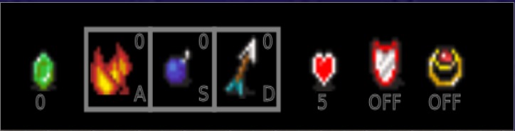

# Emerald Splash
A retro game where you fight other players with items and collect as much gems as you can.

## Installation
1. Install npm modules 
`npm install`
2. Start the server
`node ./game_server.js`

## Description
The goal of the game is to collect more gems than your opponent. Use arrow keys to move around. To prevent them from getting more gems than you, there are weapons that you can collect. As you collect the items, they will get stored in your inventory. To use them, simply press the corresponding key shown in the inventory.

_Image of the inventory_

### Items details 
**Gem** - The score of your game 

**Fire (weapon)** - Creates a burning tile on enemy's field
Press A to use

**Bomb (weapon)** - Creates a 3x3 explosion 1 second after using
Press S to use

**Arrow (weapon)** - Summons 4 arrows that are aimed at the enemy
Press D to use

**Zombie (weapon)** - Summons a zombie that chases after the enemy
Triggers automatically when collected

**Boot (buff)** - Increase the walking speed of player
Triggers automatically when collected

**Shield (buff)** - Protects player from attacks for 5 seconds
Triggers automatically when collected

**Ring (buff)** - Doubles the worth of gems collected in the next 5 seconds
Triggers automatically when collected

## Cheat Code
Press space for cheating.
effect: instant Ring ang Shield buff.
